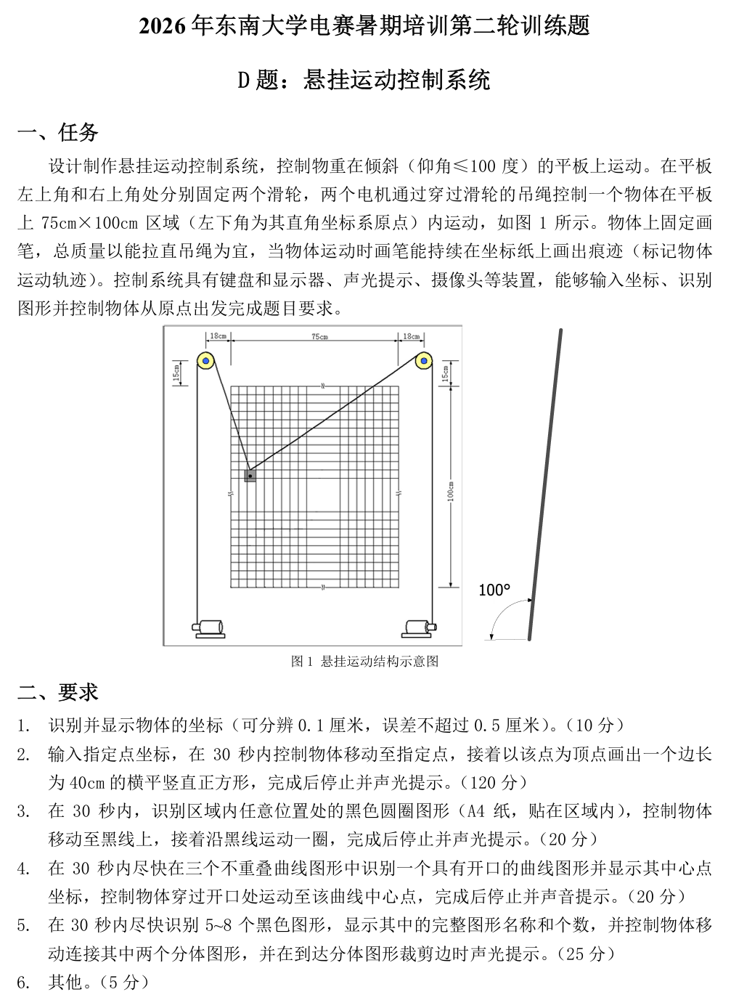
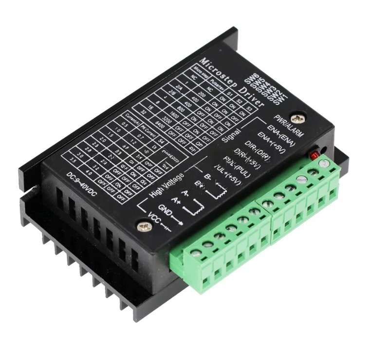

# 项目概要
# 坠机过程
暑假的第二轮训练从上周二7号开始，下午发题，昨天下午验收，一共十天时间，差不多可以排下三个四天三夜。
不出所料，看到题目的瞬间就头皮发麻：

板子？绳子？滑轮？物块？电机？大坐标纸？对于一无所有的我们来说，看来这次题目非同小可，来势汹汹。

还好我们很快想到了应对策略，滑轮可暂时用图钉替换，楼下超市有卖；物块随便找一个小物件，能打孔能拴绳；电机从淘宝购买，42步进电机理论够用，不过需要驱动，就顺手买两个驱动模块；
板子打算用寝室的象棋板；坐标纸打印或者画一下都可以；绳子去日用品店或者什么批发市场搞一点毛线或者鱼线。

主控用ESP32，摄像头用K230，接线杜邦线。总的来看，就是零级小白在野外发育，即将被满级大佬碾过。

两天后快递到了，电机是42BYGH47-401A，驱动是TB6600，它可以更改输出电流档位，也可以更改细分档位：

不过这也是我们用不到的地方，现在来看如果可以更换驱动倒是一件不错的事情，至少我们不用花费五六天的时间在这上面研究。

好在网上有相关教程，利用CodeX搞清楚ESP32的接线引脚，几根杜邦线一连，代码一烧，接上电源，电机并没有如愿以偿的转动。这里面有四个诱因：MCU驱动，电机接线，外部电源输入，以及拨码开关。

在信任CodeX的前提下可暂时不考虑MCU驱动的问题，在参考电机铭牌的前提下可以排除电机接线的问题，剩下是外部电源输入和拨码开关的问题。

外部电压一开始采用四路电源模块DCP3512，它有四个档位，最大电压可以调节到29.6V，其中12V档位和ADJ档位满足TB6600的电压9V-40V需求，实际使用无法驱动电机半步，因为输出电压不足，使用万用表测量只有可怜的8.6V。第二次换用泰华仪表的电流电压信号发生器，这个仪器的最大电压可以调节到10V，假如当时其余问题解决应该可以使用，可惜这个仪器后来也被弃用。第三次去学院淘了科一电子的多路线性直流稳压电源模块，可以调节输出电压至±12V，电压看上去没什么问题，但它的最大输出电流是0.5A，电机铭牌的额定电流是1.5A，电流显然不足。最终还是选用工位的信号发生器，将它打到24V电压，可以让电机转起来。不得不承认这个信号发生器即便表面泛黄，最终还能打开，性能也十分强劲。

拨码开关也出现了相关问题，我的TB6600有六个拨码开关，SW1-SW6，前三个控制细分档位，后三个控制电流大小。戏剧的是客服的方案不能让其跑起来，最终还是AI给出了相应的配套方案。

这其中藏得最深的问题莫过于控制端接法，原先的接法是共阳极接法，很多博客和教程上都这么写，AI也分析共阳极解法是最好用的一种接法。实测下来根本不行，我们使用的ESP32S3的GPIO输出电压在3.3V附近，但共阳极解法要求共阳的一端在5V，没有办法做到两端电势差为0。这里也有可能采用3.3V电压接入阳极可以驱动，但没有测试过。最后采用了共阴极接法，效果立竿见影。

最终在星期二的下午搞定了电机驱动内容。

回到机械机构，目前板子还想着用象棋板，后来发现边长不够，正苦恼要不要现买一块，偶然听G同学说可以去3楼借用一块，结果发现确实有这回事，借回来的木板还挺大，正好1.2mx1.2m。

接着就是滑轮、绳子和物块。滑轮和绳子按照原计划都很好解决，从学校超市购回图钉，算好距离钉在木板上就是滑轮，从便利店买到鱼线和黑白毛线就可以悬挂物块。

但物块呢，怎么解决？物块不仅仅要能平移到确定位置，还要能留下笔迹，也就是物块需要添加一个笔槽用来画痕迹。但在目前的情况下肯定是不好搞到的。幸运的是我有两个白色的小塑料盖，可以凑合使用，将一个塑料盖的两侧打上孔，穿上线，挂在图钉上，另一端缠绕在电机上，就可以旋转定位。

理想情况如此，但加上笔头就出了bug。由于塑料滑块太小，当笔头在正中间时对板子的压力太小，无法留下笔迹，而且利用绳子向上提拉滑块，笔尖往往会撬动，这造成了不小的问题。

为了解决重量问题，后来买了一块橡皮，两端用夹子夹住，缠上绳子，笔芯放中间，这样重量的问题就解决了，但撬动的问题更明显了。

后来L同学天才般的想法将笔尖移到了靠近下端的位置，装置就竟然跑起来了？能留下笔迹，也不会翘头，这太神奇了。

理想情况下这里应该快速标定，然后测试装置移动标准性，从而进行修正。此时最致命的问题来了——零点漂移，按照既定的电机步数，理论上转了一圈应当可以回到原位，但始终有5cm左右的误差，并且画出的直线也是漂移的。

我们想了很多情况，绳子与电机松了，绳子与滑块松了，滑块重量太小了，然后用热熔胶固定了绳子与电机，固定了绳子与滑块，利用橡皮增加滑块重量。效果是有的，短距离移动下的零点漂移会少很多，长距离一动就又会有很大偏差。后来L同学证实是绳子的问题，让我换用别的绳子，我问Z同学借了他们的PE线，20分钟换上去还真暂时消除了误差，不过换完绳子已经到是验收时间，当时标定还没有做，最后草草以失败告终。